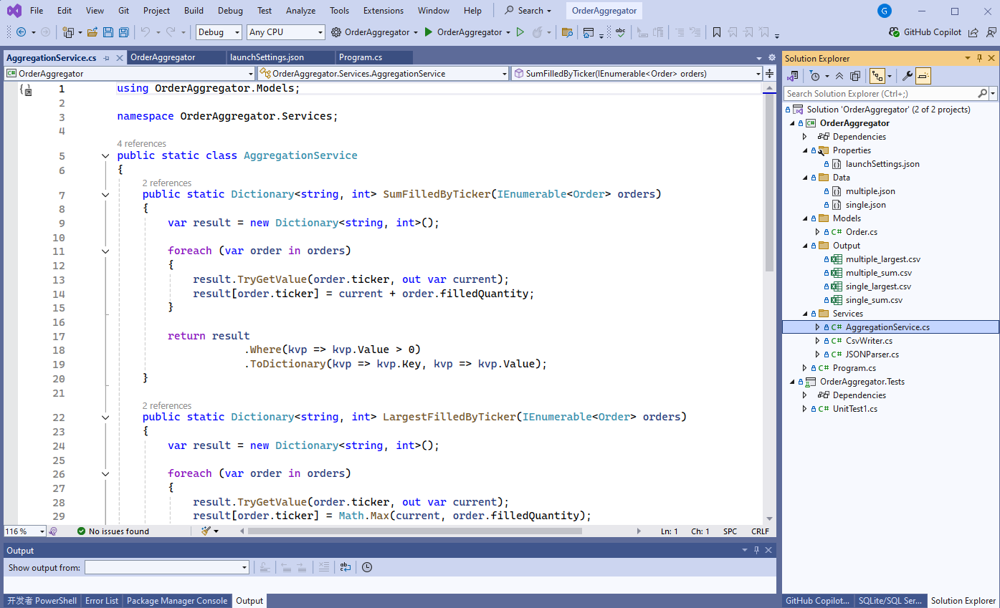

# Order Aggregator by Greg Luo

greg.luo@outlook.com, 0424376962

## Technical choices

Console application by .NET 8 and C# 12.

## Github repo

https://github.com/GregLuoDev/OrderAggregator

## Steps to run the solution locally

- In VS2022, open this solution
- Press F5 or ctrl+F5 to run it, or

- Open: "View" → "Terminal"
- In the terminal, run command:

  - dotnet run -- Data/multiple.json, or
  - dotnet run -- Data/single.json

The csv files will be generated in the "Output" folder.

## File structure

The main logic resides in the SumFilledByTicker() and LargestFilledByTicker() methods within the Services/AggregationService.cs file.

